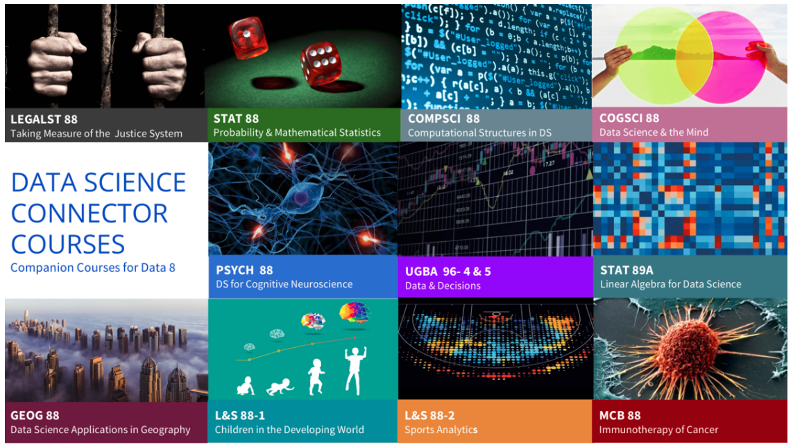

---
# YAML metadata
title: What is data science?
author: Matthew Brett
bibliography: data-science-bib/data_science.bib
urlcolor: blue
colorlinks: true
<#ifndef HANDOUT>
suppress-bibliography: true
<#endif>
---

# Thesis

* Data science is a fundamental change in scientific practice.
* Fundamental changes need careful, committed, expensive planning.
* Life Sciences must lead.
* Success or failure will have dramatic effects on our future as a University.
* We are far behind our US counterparts.

# A (bad) definition

> The now-contemplated field of Data Science amounts to a superset of the
> fields of statistics and machine learning which adds some technology for
> ‘scaling up’ to ‘big data’.

[@donoho201550]

# Initial responses

* "Data science" vocational training.
* Competition between computer science and statistics departments.

# Bad definition, bold warning

> The now-contemplated field of Data Science amounts to a superset of the
> fields of statistics and machine learning which adds some technology for
> ‘scaling up’ to ‘big data’. This chosen superset is motivated by commercial
> rather than intellectual developments. Choosing in this way is likely to
> miss out on the really important intellectual event of the next fifty years.

[@donoho201550]

# Back to beginnings

{width=100%}

[@davenport2012data]

# The data scientist in industry

> When Jeff Hammerbacher and I talked about our data science teams, we
> realized that as our organizations grew, we both had to figure out what to
> call the people on our teams. “Business analyst” seemed too limiting. “Data
> analyst” was a contender, but we felt that title might limit what people
> could do. After all, many of the people on our teams had deep engineering
> expertise. “Research scientist” was a reasonable job title used by companies
> like Sun, HP, Xerox, Yahoo, and IBM.

[@patil2011building]

# The data scientist in industry

> ... what data scientists do is make discoveries while swimming in data ...
> At ease in the digital realm, they are able to bring structure to large
> quantities of formless data and make analysis possible. ... Data scientists’
> most basic, universal skill is the ability to write code.

[@davenport2012data] - "Who Are These People?"

# The data scientist in industry

> Some of the best and brightest data scientists are PhDs in esoteric fields
> like ecology and systems biology. George Roumeliotis, the head of a data
> science team at Intuit in Silicon Valley, holds a doctorate in astrophysics.

[@davenport2012data] - "Who Are These People?"

# The data scientist in industry

> Roumeliotis was clear with us that he doesn’t hire on the basis of
> statistical or analytical capabilities. He begins his search for data
> scientists by asking candidates if they can develop prototypes in a
> mainstream programming language ...

[@davenport2012data] - "Who Are These People?"

# The origins of data science

> Far better an approximate answer to the right question, which is often
> vague, than an exact answer to the wrong question, which can always be made
> precise.

[@tukey1962future]

# Data science as foundation

> ... academic institutions should encourage the development of a basic
> understanding of data science in all undergraduates.

@natacad2018ds

> I think it likely that in ten years’ time every undergraduate programme will
> have to include some teaching in data science.

Professor Sir Adrian Smith, Director of Turing Institute, October 2019.

# What does that look like?

# Data science in Berkeley

* February 2013: [Supporting Data Science
  Workshop](https://vcresearch.berkeley.edu/supporting-data-science-campus-wide-workshop-0)
* 2013: [Berkeley Institute of Data Science](https://bids.berkeley.edu/about)
* 2015: [Foundations of data science course](http://data8.org)
* 2018: [National workshop on data science
  education](https://data.berkeley.edu/undergraduate-ds-pedagogy)
* 2018: [Division of data science:
  announced](https://news.berkeley.edu/2018/11/01/berkeley-inaugurates-division-of-data-science-and-information-connecting-teaching-and-research-from-all-corners-of-campus)

# Berkeley teaching programme

* Massive (~1500 student) course [Foundations of data
  science](https://data.berkeley.edu/education/courses/data-8) - "Data 8".  No
  requirements in mathematics or programming.  Running since 2015.
* Large (~900 student) intermediate course [Principles and techniques of data
  science](http://www.ds100.org) with further requirements in Python programming and linear algebra.
* [27 Connector courses](https://data.berkeley.edu/education/connectors):
  domain applications of teaching methods from the foundation course.
* "... embracing a reinvention of statistical education in the era of
  pervasive computation." [Report by Data science education rapid reaction
  team](https://data.berkeley.edu/sites/default/files/datasciencecurriculumsketch.pdf)
* The greatest change in undergraduate teaching in a generation.

# Spreading across campus

# Computing in the UK

* understand what algorithms are, how they are implemented as programs on
  digital devices, and that programs execute by following precise and
  unambiguous instructions;
* create and debug simple programs;
* use logical reasoning to predict the behaviour of simple programs
* use technology purposefully to create, organise, store, manipulate and
  retrieve digital content

# Coding is not a specialist skill

* understand what algorithms are, how they are implemented as programs on
  digital devices, and that programs execute by following precise and
  unambiguous instructions;
* create and debug simple programs;
* use logical reasoning to predict the behaviour of simple programs
* use technology purposefully to create, organise, store, manipulate and
  retrieve digital content

[National curriculum in computing](https://www.gov.uk/government/publications/national-curriculum-in-england-computing-programmes-of-study/national-curriculum-in-england-computing-programmes-of-study): Key stage 1 (5-7 year olds).

# Some aspects of data science

* Foundation in code
* Real, messy data
* Visualization before inference
* Reproducible practice
* Open-everything.

# Dominated by open tools

* [Python](https://stackoverflow.blog/2017/09/06/incredible-growth-python)
* [R](https://stackoverflow.blog/2017/10/10/impressive-growth-r)

Why is this?

# Our problem

* We have no statistics department.
* Our strategy is not clear.
* We are losing our [LES data
  scientists](https://www.birmingham.ac.uk/university/colleges/eps/news/2018/10/birmingham-researchers-appointed-alan-turing-fellows.aspx)
  at an astonishing rate.

# Some questions

* What is data science? A speciality?  Or a transformation in scientific
  practice?
* What will a successful university look like in 10 years time?  Will it look
  like Berkeley?  Is there another model?
* What are the costs of failure?
* What are the benefits of success?
* What changes do we need to make in:
  * Research culture?
  * Academic appointments?
  * Training?
  * Teaching?
* Who will do the work?

<#ifdef HANDOUT>
# References
<#endif>
