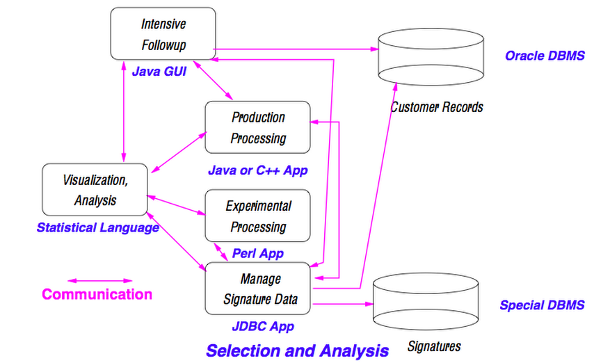

---
# YAML metadata
title: Data science is a culture not a science
author: Matthew Brett
bibliography: data-science-bib/data_science.bib
<#ifndef HANDOUT>
suppress-bibliography: true
<#endif>
---

# Handout

https://github.com/matthew-brett/data-science-discussions/blob/master/berkeley-talk/data_science_as_culture_handout.pdf

# An orientation

An answer to "What is data science?" through "How would we recognize data
science?"

# A definition and a warning

> The now-contemplated field of Data Science amounts to a superset of the
> fields of statistics and machine learning which adds some technology for
> ‘scaling up’ to ‘big data’. This chosen superset is motivated by commercial
> rather than intellectual developments. Choosing in this way is likely to
> miss out on the really important intellectual event of the next fifty years.

[@donoho201550]

# A mystery for machine-learning + big data

"Data scientists mostly do arithmetic and that's a good thing"

https://m.signalvnoise.com/data-scientists-mostly-just-do-arithmetic-and-that-s-a-good-thing-c6371885f7f6

Recommended reading for "What the *&!% is data science?" from Hadley Wickham's
"STATS 337: Readings in Applied Data Science"
https://github.com/hadley/stats337

# Another mystery for machine-learning + big data

*   Careers
*   Education and Training
*   Tools and Software
*   Reproducibility and Open Science
*   Physical and Intellectual Space
*   Data Science Studies

Moore-Sloan Data Science Environments: Themes. http://msdse.org/themes

# Back to history

See "A very short history of data science"

[@press2013history]

# But in modern use

{width=100%}

[@davenport2012data]

# The data scientist in industry

> When Jeff Hammerbacher and I talked about our data science teams, we
> realized that as our organizations grew, we both had to figure out what to
> call the people on our teams. “Business analyst” seemed too limiting. “Data
> analyst” was a contender, but we felt that title might limit what people
> could do. After all, many of the people on our teams had deep engineering
> expertise. “Research scientist” was a reasonable job title used by companies
> like Sun, HP, Xerox, Yahoo, and IBM.

[@patil2011building]

# Koan 1

What would a degree programme, division or institute of "research science"
look like?

How would it differ from a programme in "data science"?

# The data scientist in industry

> ... what data scientists do is make discoveries while swimming in data ...
> At ease in the digital realm, they are able to bring structure to large
> quantities of formless data and make analysis possible. ... Data scientists’
> most basic, universal skill is the ability to write code.

[@davenport2012data] - "Who Are These People?"

# The data scientist in industry

> Some of the best and brightest data scientists are PhDs in esoteric fields
> like ecology and systems biology. George Roumeliotis, the head of a data
> science team at Intuit in Silicon Valley, holds a doctorate in astrophysics.

[@davenport2012data] - "Who Are These People?"

# The data scientist in industry

> The best data scientists tend to be “hard scientists,” particularly
> physicists, rather than computer science majors.

Attributed to DJ Patil in [@loukides2010what_is]

# The data scientist in industry

> Roumeliotis was clear with us that he doesn’t hire on the basis of
> statistical or analytical capabilities. He begins his search for data
> scientists by asking candidates if they can develop prototypes in a
> mainstream programming language ...

[@davenport2012data] - "Who Are These People?"

# The data scientist in industry

> ... on any given day, a team member could author a multistage processing
> pipeline in Python, design a hypothesis test, perform a regression analysis
> over data samples with R, design and implement an algorithm for some
> data-intensive product or service in Hadoop, or communicate the results of
> our analyses to other members of the organization.

Jeff Hammerbacher quoted in [@loukides2010what_is]

# Koan 2

Data scientist is an industry term, but data scientists largely came from the
empirical sciences.

How did that happen?

What should we teach?

# The origins of data science

> Far better an approximate answer to the right question, which is often
> vague, than an exact answer to the wrong question, which can always be made
> precise.

[@tukey1962future]

# Tools

> If we are to make progress in data analysis .. we need to pay attention to
> our tools and our attitudes. If these are adequate, our goals will take care
> of themselves.
>
> We dare not neglect any of the tools that have proved useful in the past.
> But equally we dare not find ourselves confined to their use. If algebra and
> analysis cannot help us, we must press on just the same, making as good use
> of intuition and originality as we know how.

[@tukey1962future]

# Attitudes

> Almost all the most vital attitudes can be described in a type form:
> willingness to face up to *X*.

where *X* includes:

* more realistic problems,
* the necessarily approximate nature of useful results in data analysis,
* the need for collecting the results of actual experience with specific
  data-analytic techniques,
* the need for iterative procedures,
* free use of ad hoc and informal procedures, and
* the fact that data analysis is intrinsically an empirical science.

[@tukey1962future]

# Tukey and data science

* Fire Control Research Office
* Bell Labs
* The Kinsey Report (Cochran, Mosteller and Tukey, 1953, 1954);
* Panel on Seismic Improvement (Tukey, 1959);
* Environmental pollution (Tukey et al., 1965; Tukey, 1966);
* The National Halothane Study (Subcommittee on the National Halothane Study,
  1966; Gentleman, Gilbert and Tukey, 1969);
* National Assessment of Educational Progress (Tukey, 1970);
* Impacts of Stratospheric Change (Tukey, 1976);
* Adjustment of the U.S. Census (Ericksen et al, 1989; Tukey, 1990).

[@hoaglin2003tukey] (see article for references).

# Leo Breiman and culture in statistics

Two cultures - "data modeling" and "algorithmic modeling"

> a\) Focus on finding a good solution - that's what consultants get paid
> for.
\hfill\break
> b\) Live with the data before you plunge into modeling.
\hfill\break
> c\) Search for a model that gives a good solution, either algorithmic or
> data.
\hfill\break
> d\) Predictive accuracy on test sets is the criterion for how good the model
> is.
\hfill\break
> e\) Computers are an indispensable partner
\hfill\break

[@breiman2001statistical]

# Breiman on the modeling culture

> My feeling is, to some extent, that academic statistics may have lost its
> way.  When I came, after consulting, back to the Berkeley Department, I
> felt like I was almost entering Alice in Wonderland. That is, I knew what
> was going on out in industry and government in terms of uses of statistics,
> but what was going on in academic research seemed light years away. It was
> proceeding as though it were some branch of abstract mathematics.

[@olshen2001conversation]

# Breiman and consulting

> ... trying to figure out what freeway traffic looked like and what its
> statistical characteristics were.

> A lot of the problems that we dealt with in those days involved large
> amounts of data. For instance, in one big project we had seven years of
> hourly and daily data on over 450 variables relevant to air pollution. We
> were trying to predict next day ozone levels in the Los Angeles Basin.

> a study of delay in criminal courts in Colorado.

[@olshen2001conversation]

# John Chambers and data science

> John McKinley Chambers is the creator of the S programming language, and
> core member of the R programming language project.

https://en.wikipedia.org/wiki/John_Chambers_(statistician)

# Chambers and tools

> ... in modern computing, there should not be a sharp distinction between
> users and programmers. Most programming with statistical systems is done by
> users, and should be. As soon as the system doesn’t do quite what the user
> wants, the choice is to give up or to become a programmer, by modifying what
> the system currently does.

[@chambers1999computing]

# Chambers and consulting

{width=100%}

[@chambers1999computing]

# Koan 3

Is Tukey a data scientist?

Is Breiman?

Is Chambers?

# Koan 3

Why now?

# Why now?

* Rise of computing.
* Programming languages;
* Tools;
* Process.

# Returning to the mysteries

* "Data scientists mostly do arithmetic and that's a good thing"
* Tools and Software, Reproducibility and Open Science.

# Data science as analysis culture

What does this mean for the relationship between data science and:

* big data;
* machine learning;
* artificial intelligence;
* statistics;
* computer science;
* open-source computing;
* reproducibility;
* getting a job as a "data scientist"?

# What does this mean for

* Undergraduate teaching?
* Graduate teaching?
* Research process?

# Teaching and research process

"Teaching computational reproducibility for neuroimaging"

https://arxiv.org/abs/1806.06145

# The future of data analysis

> The future of data analysis can involve great progress, the overcoming of
> real difficulties, and the provision of a great service to all fields of
> science and technology.  Will it?  That reamains to us, our willingness to
> take up the rocky road of real problems in preference to the smooth road of
> unreal assumptions, arbitrary criteria, and abstract results without real
> attachments.  Who is for the challenge?

[@tukey1962future]

# Is this the end?

Yes, it's the end of the talk.

All material for this talk at:
https://github.com/matthew-brett/data-science-discussions/tree/master/berkeley-talk

<#ifdef HANDOUT>
# References
<#endif>
